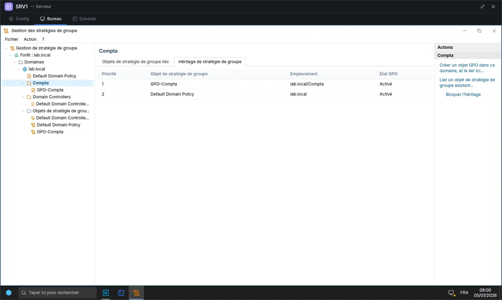
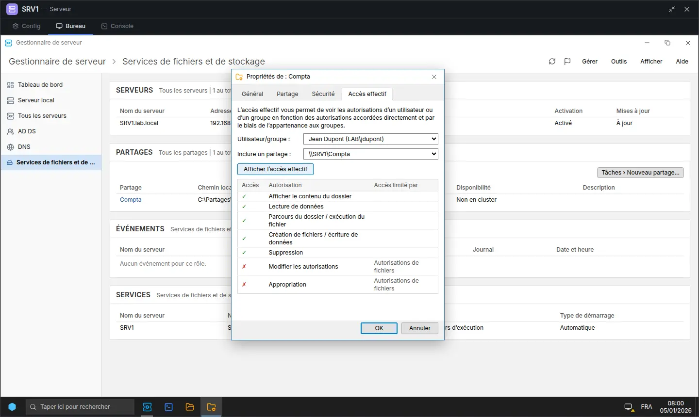
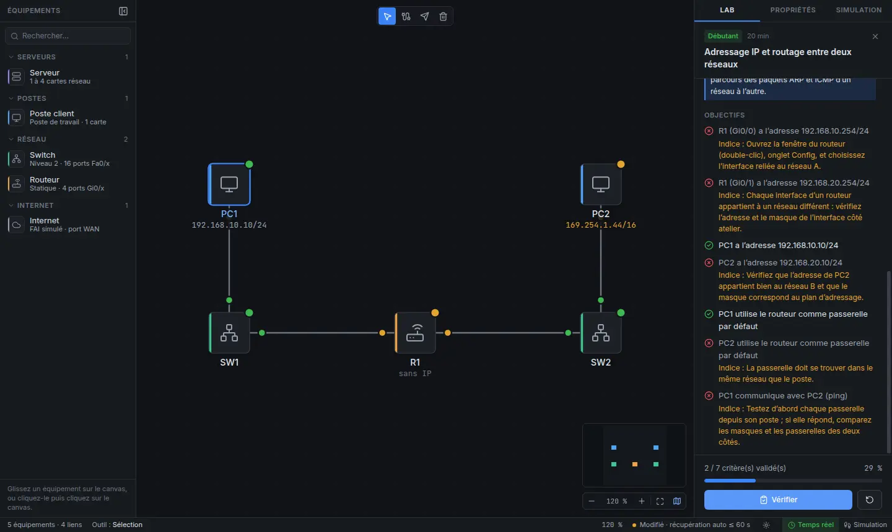

# ServerLab

Simulateur desktop d'administration de serveurs, pensé pour réviser l'**épreuve E6 du BTS SIO SISR**.
On construit une topologie (serveurs, postes, switchs, routeurs, Internet), puis on configure
les rôles serveur (AD DS, DNS, DHCP, GPO, partages) via une interface graphique ou des consoles
PowerShell / CMD simulées.

> Tout est **simulé** : aucune machine virtuelle, aucune commande système n'est exécutée.
> Projet indépendant, sans affiliation avec un éditeur de logiciels.

## Installation

Téléchargez la dernière version dans les
[Releases](https://github.com/tamalou25/packetracer-windows/releases) du dépôt :

| Système             | Fichier                           | Installation                                                                                                             |
| ------------------- | --------------------------------- | ------------------------------------------------------------------------------------------------------------------------ |
| Windows 10/11 (x64) | `ServerLab-Setup-X.Y.Z.exe`       | Assistant : pour vous seul ou pour tous, dossier au choix, raccourcis Bureau et menu Démarrer, fichiers `.slab` associés |
| Linux (x64)         | `ServerLab-X.Y.Z-x86_64.AppImage` | `chmod +x ServerLab-*.AppImage` puis lancer le fichier                                                                   |

> **Avertissement SmartScreen** : l'installeur n'est pas signé (un certificat de signature de code
> est payant). Au premier lancement, Windows affiche « Windows a protégé votre ordinateur » : cliquez
> sur **Informations complémentaires** puis **Exécuter quand même**.

### Mises à jour

L'application installée vérifie les mises à jour au démarrage et via **Aide > Rechercher des mises
à jour…** : la nouvelle version se télécharge en arrière-plan (progression dans la barre des
tâches), puis ServerLab propose de **redémarrer** — la question « Enregistrer les modifications ? »
est posée avant — ou l'installe à la fermeture. Les fichiers `.slab` et les préférences sont conservés.

> Les mises à jour lisent les releases **publiques** du dépôt, sans aucun jeton embarqué : tant que
> le dépôt GitHub est privé, la vérification répond « Aucune version publiée n'est accessible ».

## État d'avancement

| Phase | Contenu                                | État |
| ----- | -------------------------------------- | ---- |
| 1     | Squelette Electron + CI                | ✅   |
| 2     | Canvas de topologie, fichiers `.slab`  | ✅   |
| 3     | Moteur IP, mode Simulation             | ✅   |
| 4     | Consoles PowerShell / CMD              | ✅   |
| 5     | DHCP                                   | ✅   |
| 6     | DNS                                    | ✅   |
| 7     | AD DS                                  | ✅   |
| 7b    | Bureau façon serveur (fenêtres, menus) | ✅   |
| 8     | Stratégies de groupe (GPO)             | ✅   |
| 9     | Fichiers, partages, NTFS               | ✅   |
| 10    | Mode Labs                              | ✅   |
| 11    | Installeur + mises à jour              | ✅   |

## Développement

Prérequis : **Node.js 22+** et npm.

```bash
npm ci            # installe les dépendances
npm run dev       # lance l'application en mode développement
npm run lint      # ESLint + Prettier
npm run typecheck # vérification TypeScript
npm test          # tests du moteur (Vitest)
npm run test:e2e  # build + tests E2E (Playwright)
npm run dist      # installeur du système courant dans dist/ (NSIS ou AppImage)
npm run dist:dir  # application décompressée dans dist/ (test rapide, sans installeur)
```

Sous Linux sans écran (CI, conteneur) : `xvfb-run -a npm run test:e2e`.

### Publier une version

```bash
git tag v0.1.0
git push origin v0.1.0
```

Le workflow **Release** ([`.github/workflows/release.yml`](.github/workflows/release.yml)) :

1. vérifie le dépôt (lint, types, tests du moteur) puis crée la release **en brouillon** ;
2. construit en parallèle l'installeur Windows (`windows-latest`) et l'AppImage (`ubuntu-latest`)
   avec electron-builder, version alignée sur le tag, et les envoie dans la release avec
   `latest.yml` / `latest-linux.yml` (lus par les mises à jour automatiques) ;
3. publie la release une fois les deux installeurs envoyés. Un tag de préversion (`v0.2.0-beta.1`)
   donne une _pre-release_, ignorée par les mises à jour automatiques.

Seul le jeton `GITHUB_TOKEN` du workflow est utilisé (permission `contents: write`) : aucun secret à
configurer. La configuration d'empaquetage est dans [`electron-builder.yml`](electron-builder.yml) ;
la CI la vérifie à chaque push (application empaquetée puis démarrée).

## Architecture

| Dossier        | Rôle                                                                     |
| -------------- | ------------------------------------------------------------------------ |
| `src/main`     | Process principal Electron : fenêtre, menu natif, fichiers, mises à jour |
| `src/preload`  | Pont sécurisé (`contextBridge`) exposant une API minimale                |
| `src/renderer` | Interface React (canvas React Flow, panneaux, consoles)                  |
| `src/engine`   | Moteur de simulation **pur TypeScript** (testable seul)                  |
| `labs`         | Labs pédagogiques au format JSON                                         |
| `tests`        | Tests Vitest (moteur) et Playwright (E2E)                                |

Sécurité : `contextIsolation`, `sandbox`, pas de `nodeIntegration`, CSP stricte, navigation bloquée.

Voir [`CLAUDE.md`](./CLAUDE.md) pour les conventions détaillées.

## Stratégies de groupe (GPO)

- Console **Gestion des stratégies de groupe** (`gpmc.msc`, menu Outils du Gestionnaire de serveur) :
  création et liaison de GPO au domaine ou aux OU, ordre des liens, **Appliqué**, lien activé,
  **blocage de l'héritage**, état GPO, filtrage de sécurité, onglets Étendue / Détails / Paramètres.
- **Éditeur de gestion des stratégies de groupe** : stratégie de mot de passe (Default Domain Policy),
  message avant ouverture de session, papier peint, interdiction du Panneau de configuration, du menu
  Exécuter et de l'invite de commandes, mappage de lecteurs réseau (préférences).
- Application réaliste : stratégie d'ordinateur au démarrage, stratégie utilisateur à l'ouverture
  de session, `gpupdate /force`, `gpresult /r` (GPO appliquées et filtrées avec leur raison :
  sécurité, lien désactivé, GPO désactivée, vide), événements GroupPolicy, échanges LDAP/SMB visibles
  en mode Simulation.
- PowerShell : `New-GPO`, `Get-GPO`, `Rename-GPO`, `Remove-GPO`, `New-GPLink`, `Set-GPLink`,
  `Remove-GPLink`, `Get-GPInheritance`, `Set-GPInheritance`, `Get-GPPermission`, `Set-GPPermission`,
  `Invoke-GPUpdate`.



## Fichiers, partages et NTFS

- Volume `C:` simulé sur chaque serveur : **Explorateur de fichiers** (dossiers, fichiers, lecteurs
  réseau), `dir`, `mkdir`, `rmdir`, `del`, `cd`, `Get-ChildItem`, `New-Item`, `Remove-Item`.
- Autorisations **NTFS** explicites et héritées (onglet Sécurité, `icacls`, `Get-Acl`), désactivation
  de l'héritage (conversion ou suppression), ordre canonique : refus explicite prioritaire.
- **Partages SMB** : Partage avancé, assistant Nouveau partage du Gestionnaire de serveur,
  `New-SmbShare`, `Grant/Revoke/Block-SmbShareAccess`, `net share`, partages administratifs (`C$`…).
- **Accès effectif** : droits d'un utilisateur ou d'un groupe, avec ce qui les limite (partage ou NTFS) ;
  accès réseau = le plus restrictif des deux.
- Depuis un poste : `\\serveur\partage` dans l'Explorateur, **Connecter un lecteur réseau**, `net use`,
  `net view`, erreurs réalistes (53, 67, 5), échanges SMB visibles en mode Simulation ; papier peint
  de stratégie lu sur un partage.



## Écran d'accueil

Au lancement sans fichier, l'accueil propose **Nouveau lab**, **Ouvrir…**, les labs récents (nom,
dossier, date ; un fichier déplacé ou supprimé est signalé « Introuvable » et peut être retiré de
la liste) et les labs fournis avec leur difficulté et leur durée. Il reste accessible par
**Fichier > Accueil** ; la case « Afficher l'accueil au démarrage » permet de démarrer directement
sur le canvas.

## Tutoriel interactif

Au premier lancement, un tutoriel guide jusqu'au premier ping : placer un serveur et un poste,
les câbler, leur donner une adresse IP fixe dans le même réseau, puis tester avec `ping` (console
ou outil PDU simple). La zone à utiliser est entourée et chaque étape se valide d'elle-même dès
que le lab est dans le bon état (pas de bouton « Suivant »). Le tutoriel peut être passé, n'est
plus proposé une fois réussi (ou si la case « Proposer le tutoriel au démarrage » est décochée)
et se relance par **Aide > Tutoriel interactif**.

## Labs pédagogiques

L'accueil et **Fichier > Ouvrir un lab…** (`Ctrl+L`) proposent cinq labs prêts à l'emploi, du plus simple au plus
complet : adressage et routage, DHCP, DNS, Active Directory + GPO, partages et NTFS. Chaque lab
construit sa topologie de départ ; l'onglet **Lab** affiche l'énoncé et les objectifs, et
**Vérifier** valide chaque critère (✅ / ❌) avec un indice qui oriente sans donner la solution.
Le lab en cours est conservé dans le fichier `.slab` enregistré.

Les labs sont des fichiers JSON du dossier [`labs/`](labs) (énoncé Markdown, topologie de départ,
critères typés). Chaque lab est couvert par un test qui applique sa solution et exige 100 %.


